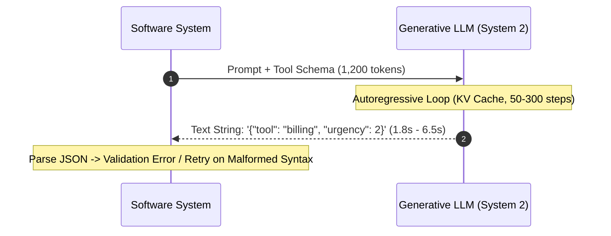
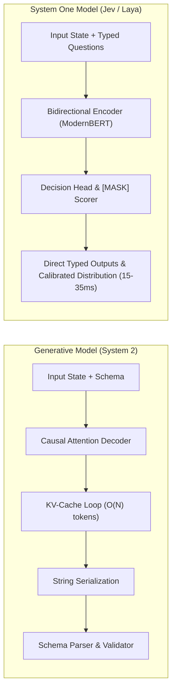

# 0001: Foundations of the System One AI Architecture

## 1. The Dual-Process Cognitive Paradigm in AI

In 2011, Daniel Kahneman codified human cognition into two complementary modes of thought in *Thinking, Fast and Slow*:
- **System 1**: Operates automatically, fast, with little or no effort, handling reflexive pattern matching, immediate threat detection, and intuitive classification.
- **System 2**: Allocates attention to effortful mental operations, including complex computations, formal logic, multi-step planning, and deliberate reasoning.

In modern AI engineering (2024–2026), the industry heavily prioritized **System 2** reasoning models (OpenAI o1/o3, DeepSeek R1). These models use test-time compute: they emit hundreds or thousands of tokens of sequential reasoning ("thinking out loud") before producing an answer.

While System 2 models excel at theorem proving, high-level code refactoring, and multi-step planning, using them for high-frequency infrastructure decisions is an **architectural anti-pattern**.

### The Anti-Pattern: Generative Tool Calling & Routing

When an agent needs to decide:
- *Which tool should handle this query?*
- *Is this generated shell command safe to execute (`rm -rf` vs `git status`)?*
- *What is the urgency of this incoming support ticket (0 to 5)?*
- *Does this email represent an escalation risk?*

Developers historically used causal, autoregressive LLMs (GPT-4o, Claude 3.5 Sonnet, Llama-3-70B) prompted with function schemas or JSON output constraints.

#### Why Generative LLMs Fail at Decision Gating:
1. **$O(N)$ Serial Latency**: Every output token requires a full forward pass through the transformer decoder. Emitting 50 tokens at 20ms/token costs 1,000ms minimum.
2. **Structural Fragility**: The output is generated as characters from a vocabulary of 32,000 to 128,000 tokens. Even with constrained grammar decoding (JSON mode), the model can produce semantically hallucinated keys or non-existent tool names.
3. **Uncalibrated Confidence**: When an autoregressive LLM emits *"I am 95% confident"*, that probability is a verbalized token string, not a calibrated statistical frequency.
4. **Extreme Economic Overhead**: Paying input and output token taxes on every internal decision in an automated agent loop destroys system throughput.

---

## 2. Enter System One Models: Deleting the Decoder

A **System One model** (pioneered by TypeSafe AI's **Jev** and Convai Innovations' **Laya**) completely removes the autoregressive decoder loop.

### Architectural Contrast

| Dimension | Generative Model (System 2) | System One Model (Jev / Laya) |
| :--- | :--- | :--- |
| **Backbone** | Autoregressive Decoder (e.g. Llama, GPT) | Bidirectional Encoder (ModernBERT, mmBERT) |
| **Attention Pattern** | Causal (Lower Triangular Mask) | Fully Bidirectional (Full Attention Matrix) |
| **Execution Steps** | $N$ sequential autoregressive passes ($N = \text{tokens}$) | **Exactly 1 forward pass** ($O(1)$) |
| **Inference Latency** | $800\text{ ms} - 15,000\text{ ms}$ | **$15\text{ ms} - 45\text{ ms}$** |
| **Output Type** | Text string (must parse JSON/YAML) | Direct typed scalars, booleans, and probability vectors |
| **Type Safety** | Fragile (grammar guidance or runtime retry) | **Structural** (Softmax over candidate `[MASK]` tokens) |
| **Confidence** | Uncalibrated / heuristic verbalization | **Mathematically Calibrated via RLCD** |
| **Batching Efficiency** | Multiple questions multiply output tokens | Multiple questions share the encoder pass for near-zero extra cost |

---

## 3. Structural Type Safety: The `[MASK]` Scoring Principle

In standard generative classification, the model computes:
$$P(\text{token} \mid \text{context}) = \text{Softmax}(W_{\text{vocab}} h_t) \quad \text{where } W_{\text{vocab}} \in \mathbb{R}^{V \times D}, \; V \approx 128,000$$

Because the softmax is taken over all $V$ tokens in the dictionary, the model can emit any token.

In a System One model, **there is no vocabulary projection**. Instead:
1. Each candidate option is prepended with a `[MASK]` token in the input sequence.
2. The bidirectional encoder computes hidden contextual representations for all tokens simultaneously.
3. The decision head extracts only the hidden vectors $m_1, m_2, \dots, m_K$ located at the exact positions of the `[MASK]` tokens.
4. A compact scalar projection scores each marker vector:
   $$s_i = W_2 \cdot \text{GELU}(W_1 \cdot \text{LayerNorm}(m_i)) \in \mathbb{R}$$
5. The output probability distribution is computed across **only** the $K$ candidate options:

$$
P(\text{option}_i) = \frac{\displaystyle e^{s_i / T}}{\displaystyle \sum_{j=1}^{K} e^{s_j / T}}
$$

> **The Mathematical Invariant**:
> Because the softmax denominator sums exclusively over the $K$ candidate options supplied in the query, it is mathematically and physically impossible for the model to emit an option that does not exist in the schema. There is no schema validation step because invalid outputs cannot be represented.

---

## 4. Key Takeaways
1. System One models are not small chatbots; they are **native decision engines** that operate at the speed of compiled code.
2. By replacing generative decoders with bidirectional encoders and `[MASK]` marker scoring, they reduce latency by 98% and guarantee structural type safety.
3. They form the foundational fast layer of modern compound AI systems, working in tandem with System 2 deliberative models.
