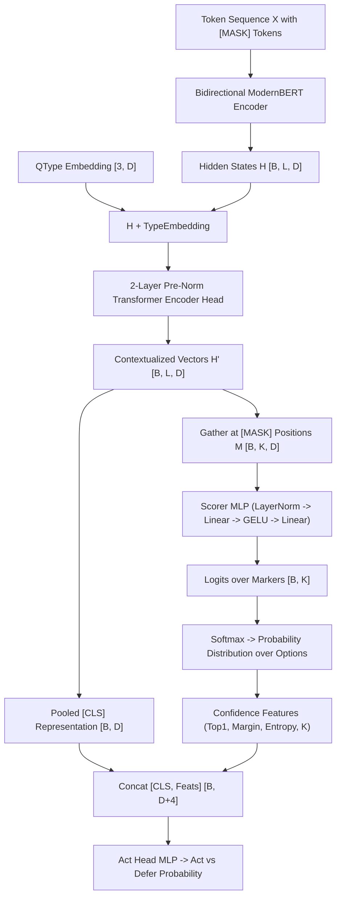

# 0002: Bidirectional Encoder Mechanics & [MASK] Marker Scoring

## 1. Sequence Construction & Token Packing

The core mechanics of System One models rely on a unified token sequence containing the question metadata, the options with designated scoring markers, and the state to be evaluated.

### Sequence Layout Format

```
[CLS] <qtype> question: <instructions> [SEP] [MASK] opt_0 [MASK] opt_1 ... [SEP] <state> [SEP]
```

Where:
- `[CLS]`: Special token at index 0 used for pooled sequence representation.
- `<qtype>`: The question primitive (`choice`, `score`, or `noul`).
- `<instructions>`: Natural language prompt specifying the decision criterion (e.g., *"Which team owns this ticket?"*).
- `[SEP]`: Delimiter separating instruction, options, and state.
- `[MASK] opt_i`: The candidate options, each preceded immediately by the tokenizer's mask token (`[MASK]`).
- `<state>`: The context or state being inspected (formatted as natural prose).

### Mathematical Representation

Let sequence length be $L$. The token IDs vector is:
$$X = [x_0, x_1, \dots, x_{L-1}] \in \mathbb{N}^L$$

The marker indices vector records the exact positional coordinates of each `[MASK]` token:
$$M = [m_1, m_2, \dots, m_K] \quad \text{where } x_{m_i} = \text{id}(\text{[MASK]})$$

Along with a binary validity mask for variable option counts:
$$\text{mask}_i = \begin{cases} 1 & \text{if } i \le K \\ 0 & \text{if padded} \end{cases}$$

---

## 2. The Neural Backbone: ModernBERT & Bidirectional Attention

System One models select **ModernBERT** (or **mmBERT** for multilingual) rather than causal decoders (GPT/Llama):

1. **Unmasked Self-Attention**:
   Unlike causal models where token $i$ can only attend to tokens $j \le i$, bidirectional encoders allow every token in the sequence to attend to every other token:
   $$\text{Attention}(Q, K, V) = \text{softmax}\left(\frac{Q K^T}{\sqrt{d_k}}\right) V$$
   This enables the option markers to directly attend forward to the entire state and backward to the instructions simultaneously.

2. **Rotary Position Embeddings (RoPE)**:
   ModernBERT uses rotary embeddings, allowing long-context scaling (up to 8,192 tokens in `laya-multilingual`) without loss of positional fidelity.

3. **Unpadding & FlashAttention / SDPA**:
   ModernBERT natively strips padding tokens before self-attention kernels, ensuring GPU compute is spent strictly on real tokens, delivering up to $3\times$ speedup over legacy BERT models.

---

## 3. The Decision Head Architecture

Once the bidirectional encoder processes the token sequence, it outputs hidden states:
$$H = \text{Encoder}(X) \in \mathbb{R}^{B \times L \times D}$$
*(where $B$ is batch size, $L$ is sequence length, $D$ is hidden dimension, e.g. 1024 for ModernBERT-large).*



### PyTorch Tensor Mechanics: Gathering Markers

Rather than taking a pooled average or predicting a fixed vocabulary vector, the model gathers the specific slices of $H'$ where the `[MASK]` tokens were placed:

```python
# idx expands marker positions across hidden dimension D: [B, K, D]
idx = marker_pos.clamp(min=0)[:, :, None].expand(-1, -1, h.size(-1))

# Gather vectors at exact [MASK] indices:
m = torch.gather(h, 1, idx)  # Shape: [B, K, D]

# Score each marker independently:
# Scorer is: LayerNorm(D) -> Linear(D, D) -> GELU() -> Linear(D, 1)
logits = self.scorer(m).squeeze(-1).float()  # Shape: [B, K]

# Mask out padded options (fill with -1e4):
logits = logits.masked_fill(~marker_mask, -1e4)

# Compute calibrated probabilities strictly over supplied options:
probabilities = torch.softmax(logits / temperature, dim=-1)
```

---

## 4. The Act Head: Calibrated Abstention & Guardrailing

In mission-critical software, a decision engine must know **when it is uncertain** and either defer to human review or escalate to a System 2 deliberative model.

Laya introduces an **Act Head** that runs in parallel with the scorer:

1. **Feature Extraction from the Decision Distribution**:
   - $\text{top}_1$: The highest predicted probability.
   - $\text{margin} = \text{top}_1 - \text{top}_2$: The confidence gap between the first and second best choices.
   - $\text{Entropy}_{\text{norm}} = -\frac{\sum p_i \ln p_i}{\ln K}$: Normalized distribution entropy ($0 = \text{certain}$, $1 = \text{uniform confusion}$).
   - $K / 255$: Normalized option count.

2. **Classification**:
   The pooled sequence vector $H'_{0}$ (`[CLS]`) is concatenated with these 4 statistical features into a vector of shape $[B, D + 4]$:
   $$\text{ActLogits} = W_4 \cdot \text{GELU}(W_3 \cdot [H'_{0} \,\|\, \text{top}_1 \,\|\, \text{margin} \,\|\, \text{Entropy}_{\text{norm}} \,\|\, K/255])$$

This outputs a binary decision:
- **Act (0)**: Confidence is sufficient to execute the action automatically.
- **Defer (1)**: Entropy is high or margin is narrow; route to human approval or System 2 fallback.

---

## 5. Summary Matrix: Key Formulas

| Concept | Mathematical Formula | Tensor Dimension |
| :--- | :--- | :--- |
| **Encoder Hidden State** | $H = \text{ModernBERT}(X)$ | $[B, L, 1024]$ |
| **Marker Extraction** | $M_k = H_{m_k}$ | $[B, K, 1024]$ |
| **Marker Score** | $s_k = W_2 \text{GELU}(W_1 \text{LN}(M_k))$ | $[B, K]$ |
| **Structural Probability** | $p_k = \frac{e^{s_k / T}}{\sum_{j} e^{s_j / T}}$ | $[B, K]$ |
| **Normalized Entropy** | $\mathcal{H} = -\frac{\sum p_k \ln p_k}{\ln K}$ | $[B, 1]$ |
| **Act Input Vector** | $z = [H_0 \,\|\, p_{(1)} \,\|\, (p_{(1)} - p_{(2)}) \,\|\, \mathcal{H} \,\|\, K/255]$ | $[B, 1028]$ |
