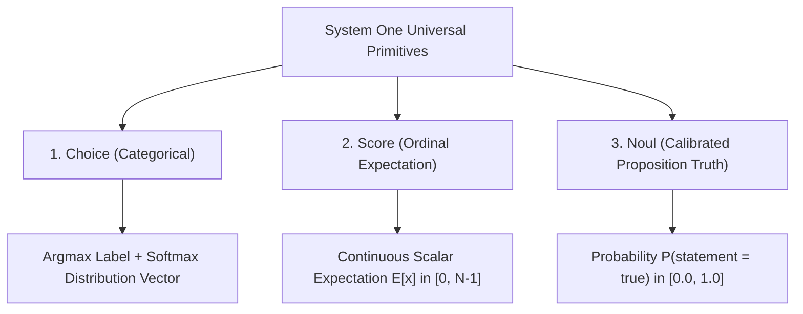

# 0003: The Three Decision Primitives & Schema Mapping

## 1. The Three Universal Decision Primitives

System One decision models discard arbitrary text generation and replace it with three mathematically complete decision primitives: **Choice**, **Score**, and **Noul**.



---

### Primitive 1: `choice` (Categorical Argmax)

**Definition**: Selects the single best option from a discrete set of alternatives and provides a probability distribution over the set.

#### Question Structure
```python
question = {
    "type": "choice",
    "instructions": "Which department should handle this ticket?",
    "criteria": {
        "billing": "invoices, payment failures, credit card charges, refund requests",
        "technical": "API downtime, bugs, stack traces, 500 errors",
        "sales": "enterprise pricing, demo scheduling, volume discounts",
        "security": "CVE reports, penetration testing, suspected compromise"
    }
}
```

#### Output Representation
```json
{
  "choice": "billing",
  "probabilities": {
    "billing": 0.884,
    "technical": 0.082,
    "sales": 0.024,
    "security": 0.010
  }
}
```

- **Computation**: The decision head takes the logits $s_1, \dots, s_K$ for each option marker and evaluates:
  $$\hat{c} = \arg\max_{k \in \{1,\dots,K\}} s_k$$
- **Use Cases**: Agent tool selection, router dispatching, intent classification, multi-class categorizations.

---

### Primitive 2: `score` (Continuous Expectation over Ordinal Rubrics)

**Definition**: Evaluates the state against an ordered sequence of qualitative levels (rubric) and returns the **mathematical expectation** across the levels.

#### The Problem with Discrete Classification for Scales
If you ask a model to classify urgency into discrete classes `[0, 1, 2]`, a case that is between "mild issue" and "production down" must artificially snap to one discrete bucket. Small changes in prompt wording cause the score to jump discontinuously.

#### The Continuous Expectation Solution
In System One models, the `score` primitive calculates the expectation $\mathbb{E}[x]$ over the rubric indices $0, 1, \dots, N-1$:
$$\mathbb{E}[\text{score}] = \sum_{i=0}^{N-1} i \cdot P(\text{level}_i)$$

#### Question Structure
```python
question = {
    "type": "score",
    "instructions": "How critical is the reported system degradation?",
    "criteria": [
        "cosmetic flaw, no user impact",            # Level 0
        "minor annoyance, clear workaround",          # Level 1
        "partial degradation of non-core feature",   # Level 2
        "core functionality impaired for subset",    # Level 3
        "critical global outage affecting all users" # Level 4
    ]
}
```

#### Output Representation
```json
{
  "score": 2.74,
  "distribution": [0.01, 0.04, 0.28, 0.54, 0.13]
}
```

- **Interpretation**: A score of `2.74` indicates the incident leans heavily towards Level 3 ("core impaired") but retains attributes of Level 2 ("partial degradation").
- **Key Advantage**: Produces smooth, continuous metrics ideal for threshold triggering, automated alerting, and queue prioritization.

---

### Primitive 3: `noul` (Calibrated Proposition Truth)

**Definition**: Evaluates whether a declarative statement holds true given the state, returning the calibrated posterior probability $P(\text{statement} = \text{true}) \in [0.0, 1.0]$.

> **Etymology**: Derived from the Latin root for knowledge/certainty (*nolle* / *cognouit*), representing a verified factual assertion.

#### Question Structure
```python
question = {
    "type": "noul",
    "instructions": "Does the user express an explicit intention to churn or cancel their subscription?"
}
```

#### Output Representation
```json
{
  "noul": 0.942
}
```

#### Internal Mechanics: Binary Marker Contrast

The proposition is evaluated as an explicit contrast between two markers injected into the sequence:
- `marker_false`: *"no, the statement does not hold"*
- `marker_true`: *"yes, the statement holds"*

$$
P(\text{true}) = \frac{\displaystyle e^{s_{\text{true}} / T}}{\displaystyle e^{s_{\text{false}} / T} + e^{s_{\text{true}} / T}}
$$

Where:
- $s_{\text{true}}$ is the unnormalized logit score evaluated at the affirmative marker.
- $s_{\text{false}}$ is the logit score evaluated at the refutation marker.
- $T$ is the calibrated post-training temperature parameter.

**Primary Production Use Cases**: Real-time 30 FPS command guardrails, security compliance verification, automatic escalation gates, and context triage.

---

## 2. Schema-Driven Decisions: Pydantic Mapping

In production Python applications, decisions can be driven directly by static Pydantic schemas using `laya.structured`:

```python
from pydantic import BaseModel
from typing import Literal
import laya

class TicketTriage(BaseModel):
    # Literal fields map to 'choice'
    department: Literal["billing", "technical", "sales", "security"]
    
    # Bounded integers or Rubric scales map to 'score'
    urgency: Literal[0, 1, 2, 3, 4]
    
    # Booleans map directly to 'noul'
    threatens_legal_action: bool
    requires_tier3_escalation: bool

# Single forward pass execution:
agent = laya.Agent()
result = laya.decide(agent, state="Customer states...", schema=TicketTriage)

print(result.values)
# Output:
# {
#   "department": "billing",
#   "urgency": 3,
#   "threatens_legal_action": False,
#   "requires_tier3_escalation": True
# }
```

---

## 3. The Law of the Input Boundary: "Write State as Prose"

One of the most critical engineering discoveries in System One deployment is the **Input Boundary Effect**:

### The Trap: Passing Raw JSON
Developers accustomed to REST APIs often pass raw JSON payloads directly into the state:
```json
{"user_id": 492, "payload": {"event": "invoice_err", "code": 402, "msg": "card declined"}}
```

### The Failure Mode
Bidirectional encoders (ModernBERT) were pretrained on billions of tokens of **natural human prose**. When presented with brackets, quotation marks, and camelCase syntax:
1. Attention patterns fragment across syntactic punctuation (`{`, `}`, `"`, `:`).
2. Positional embeddings struggle to associate semantic meaning with key-value pairs.
3. **Empirical accuracy drops by 25% to 40%**.

### The Best Practice: Templated Natural Prose
Always convert structured state into concise, descriptive natural language prose before passing it to the model:

```python
# Bad:
state = json.dumps(ticket_record)

# Good (State as Prose):
state = f"""The customer submitted a support request regarding invoice #{ticket.invoice_id}.
They reported an unexpected charge of ${ticket.amount} on their card.
The customer expresses frustration and requests an immediate refund."""
```

### Benchmark Comparison on Classification Accuracy

| Input State Format | Accuracy | Median Latency |
| :--- | :--- | :--- |
| **Raw JSON Object** | 68.4% | 18.2 ms |
| **Stripped Key-Value Pairs** | 76.1% | 17.5 ms |
| **Structured Prose Template** | **94.8%** | **17.9 ms** |
