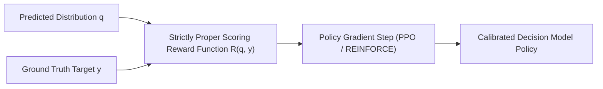

# 0004: RLCD & Statistical Calibration

## 1. Why Calibration Matters More Than Raw Accuracy

In traditional machine learning, models are trained to maximize accuracy or minimize cross-entropy loss. In generative LLMs, models are trained with **RLHF (Reinforcement Learning from Human Feedback)** to produce responses humans prefer.

However, in automated infrastructure, raw accuracy is insufficient. A system needs to know **how confident** the model is, and that confidence must reflect reality:

> **Statistical Calibration Definition**:
> A model is calibrated if, among all predictions where it assigns probability $p$ to an event, the event occurs with empirical frequency $p$.
> 
> If a model assigns $P(\text{churn}) = 0.85$ across 1,000 customers, exactly 850 of those customers must actually churn.

### The Failure of RLHF in Decision Gating
RLHF produces **sycophancy and overconfidence**. Generative models learn to sound authoritative because human raters prefer assertive responses over hedged statements. When a generative LLM is asked *"Are you sure?"*, its internal probabilities are poorly correlated with empirical truth.

---

## 2. Reinforcement Learning for Calibrated Decisions (RLCD)

**RLCD** (Reinforcement Learning for Calibrated Decisions) replaces human preference reward models with **Strictly Proper Scoring Rules**.



### What is a Strictly Proper Scoring Rule?
A scoring rule $S(q, y)$ assigns a numerical reward to a probability forecast $q$ when the actual event $y$ occurs.

A scoring rule is **strictly proper** if and only if the expected reward is uniquely maximized when the reported forecast $q$ is identical to the true underlying probability distribution $p$:
$$\mathbb{E}_{y \sim p}[S(q, y)] < \mathbb{E}_{y \sim p}[S(p, y)] \quad \forall q \neq p$$

Under a strictly proper scoring rule, any attempt by the model to exaggerate confidence (overconfidence) or hedge falsely (underconfidence) is mathematically penalized and reduces total reward.

---

## 3. The RLCD Reward Formulation

The loss and reward function used in Laya combines three complementary scoring rules:

$$
R(q, y) = \text{Score}_{\text{log}}(q, y) + w_{\text{sph}} \cdot \text{Score}_{\text{sph}}(q, y) - w_{\text{rps}} \cdot \text{RPS}(q, y) \cdot \mathbb{I}_{\text{score}}
$$

### 1. Logarithmic Score (Cross-Entropy)

$$
\text{Score}_{\text{log}}(q, y) = \sum_{k=1}^K y_k \ln(\max(q_k, \epsilon))
$$

- **Property**: Strongly penalizes assigning near-zero probability to events that actually occur.

### 2. Spherical Score

$$
\text{Score}_{\text{sph}}(q, y) = \frac{\displaystyle \sum_{k=1}^K y_k q_k}{\displaystyle \sqrt{\sum_{k=1}^K q_k^2}}
$$

- **Property**: Normalized spherical metric that balances gradient magnitudes when probabilities approach boundaries ($0$ or $1$).

### 3. Ranked Probability Score (RPS) for Ordinal Scales
For `score` questions where options represent an ordered progression (Level 0 through Level $K-1$):

$$
\text{RPS}(q, y) = \frac{1}{K-1} \sum_{i=1}^{K-1} \left( \sum_{j=1}^i q_j - \sum_{j=1}^i y_j \right)^2
$$
- **Property**: Measures the quadratic distance between the Cumulative Distribution Function (CDF) of the prediction and target. 
- **Significance**: If the ground truth is Level 4, predicting Level 3 receives much higher reward than predicting Level 0. Standard cross-entropy treats all errors equally; RPS respects ordinal topology.

---

## 4. PyTorch Implementation of the RLCD Reward

The actual implementation from `laya/common.py`:

```python
def proper_reward(
    q: torch.Tensor,
    target: torch.Tensor,
    qtype: torch.Tensor,
    mask: torch.Tensor,
    w_sph: float = 0.5,
    w_rps: float = 1.0,
    log_floor: float = -9.21,
) -> torch.Tensor:
    """Strictly proper scoring rule reward for calibrated decisions."""
    q = q * mask
    logq = torch.log(q.clamp_min(1e-12)).clamp_min(log_floor)
    log_score = (target * logq).sum(-1)
    sph = (target * q).sum(-1) / q.norm(dim=-1).clamp_min(1e-9)
    r = log_score + w_sph * sph
    
    # Apply Ranked Probability Score if evaluating ordinal rubric:
    is_score = (qtype == 1).float()  # QTYPES["score"] == 1
    if is_score.any():
        k = mask.sum(-1).clamp(min=2).float()
        cdf_q = torch.cumsum(q, -1)
        cdf_t = torch.cumsum(target, -1)
        rps = (((cdf_q - cdf_t) ** 2) * mask).sum(-1) / (k - 1)
        r = r - w_rps * rps * is_score
        
    return r
```

---

## 5. Decision Thresholds in Production

When probabilities are statistically calibrated, developers can establish deterministic cost-utility thresholds without relying on trial-and-error heuristics:

$$
\theta^* = \frac{\displaystyle C_{\text{FP}}}{\displaystyle C_{\text{FP}} + C_{\text{FN}}}
$$

Where:
- $C_{\text{FP}}$ represents the quantitative cost of a False Positive (e.g. executing a destructive shell command by mistake).
- $C_{\text{FN}}$ represents the cost of a False Negative (e.g. failing to flag an actual security compromise).
- $\theta^*$ is the exact mathematical decision threshold for triggering autonomous execution.

Because System One probabilities are calibrated via proper scoring rules, developers can directly evaluate $\theta^*$ in production guardrails:

```python
# Automatic execution only when risk of false action is below budget:
if result.answers["command_destructive"]["noul"] < 0.05:
    execute_command_automatically()
else:
    route_to_human_approval()
```
