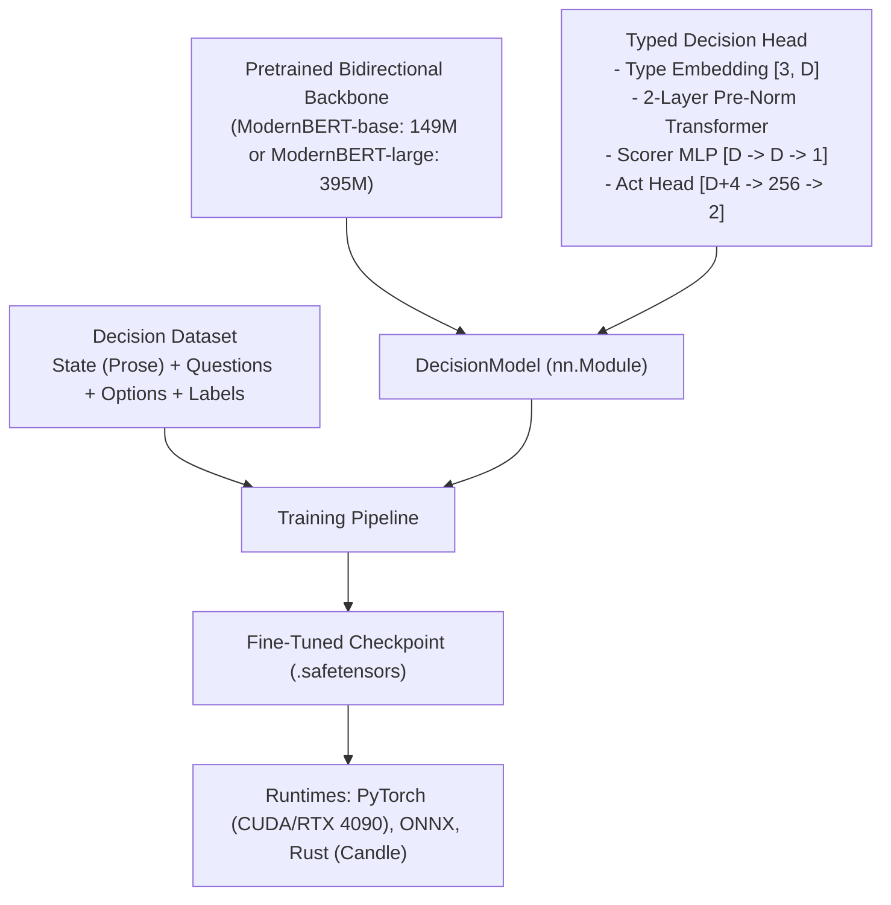

# 0005: Pretraining, Fine-Tuning & Building a Custom System One Model

## 1. Architectural Blueprint for Custom System One Models

Building a custom System One decision engine does not require pretraining a foundation model from scratch. Instead, we graft a specialized typed decision head onto a modern bidirectional encoder backbone (such as **ModernBERT** or **mmBERT**) and fine-tune it with RLCD or proper scoring rules.



---

## 2. Complete PyTorch Implementation of the Architecture

Here is the exact, self-contained neural architecture code to create a custom System One model:

```python
import torch
import torch.nn as nn
from transformers import AutoModel, AutoConfig

class CustomSystemOneHead(nn.Module):
    def __init__(self, hidden_dim: int, head_layers: int = 2, dropout: float = 0.1):
        super().__init__()
        self.hidden_dim = hidden_dim
        
        # 1. Question Type Embeddings (0: choice, 1: score, 2: noul)
        self.type_emb = nn.Embedding(3, hidden_dim)
        
        # 2. Contextual Transformer Head (Pre-Norm)
        nhead = max(1, hidden_dim // 64)
        layer = nn.TransformerEncoderLayer(
            d_model=hidden_dim,
            nhead=nhead,
            dim_feedforward=4 * hidden_dim,
            dropout=dropout,
            batch_first=True,
            norm_first=True
        )
        self.transformer_head = nn.TransformerEncoder(layer, num_layers=head_layers)
        
        # 3. Marker Scorer MLP
        self.scorer = nn.Sequential(
            nn.LayerNorm(hidden_dim),
            nn.Linear(hidden_dim, hidden_dim),
            nn.GELU(),
            nn.Linear(hidden_dim, 1)
        )
        
        # 4. Act Head (Selective Abstention)
        self.act_head = nn.Sequential(
            nn.Linear(hidden_dim + 4, 256),
            nn.GELU(),
            nn.Linear(256, 2)
        )

    def forward(self, encoder_hidden_states, attention_mask, marker_positions, marker_mask, qtype):
        """
        encoder_hidden_states: [B, L, D]
        attention_mask: [B, L]
        marker_positions: [B, K]
        marker_mask: [B, K]
        qtype: [B]
        """
        # Inject question type inductive bias
        h = encoder_hidden_states + self.type_emb(qtype)[:, None, :]
        
        # Pass through contextual decision head
        pad_mask = ~attention_mask.bool()
        h = self.transformer_head(h, src_key_padding_mask=pad_mask)
        
        # Gather vectors at the exact [MASK] coordinates: [B, K, D]
        idx = marker_positions.clamp(min=0)[:, :, None].expand(-1, -1, self.hidden_dim)
        marker_vectors = torch.gather(h, 1, idx)
        
        # Score markers: [B, K]
        logits = self.scorer(marker_vectors).squeeze(-1).float()
        logits = logits.masked_fill(~marker_mask, -1e4)
        
        # Extract confidence features
        probs = torch.softmax(logits.detach(), dim=-1)
        k = marker_mask.sum(-1).clamp(min=2).float()
        entropy = -(probs * torch.log(probs.clamp_min(1e-9))).sum(-1) / torch.log(k)
        top2 = probs.topk(2, dim=-1).values
        margin = top2[:, 0] - top2[:, 1]
        
        # Act head classification: [B, 2]
        cls_pooled = h[:, 0].float()
        feats = torch.stack([top2[:, 0], margin, entropy, k / 255.0], dim=-1)
        act_logits = self.act_head(torch.cat([cls_pooled, feats], dim=-1))
        
        return logits, act_logits
```

---

## 3. Training & Fine-Tuning Pipeline

### Phase 1: Dataset Formatting
Each sample in the dataset is structured as:
```json
{
  "state": "The user reported receiving HTTP 504 Gateway Timeout on checkout endpoints.",
  "qtype": 0,
  "instructions": "Which team should investigate this error?",
  "options": [
    "infrastructure: cloud instances, load balancers, CDN",
    "payments: stripe webhooks, credit card processing",
    "frontend: react hydration, client-side routing"
  ],
  "target_index": 0
}
```

### Phase 2: Tokenization & Sequence Construction
Construct the input sequence containing `[MASK]` tokens and record their indices:

```python
def tokenize_decision_sample(tokenizer, sample, max_len=512):
    mask_token = tokenizer.mask_token
    
    # 1. Format question header
    q_str = f"{sample['instructions']}"
    head_tokens = tokenizer(q_str, add_special_tokens=False)["input_ids"]
    
    # 2. Format options with [MASK] prefixes
    opt_tokens = []
    for opt in sample["options"]:
        tokens = tokenizer(f" {opt}", add_special_tokens=False, max_length=48, truncation=True)["input_ids"]
        opt_tokens.append([tokenizer.mask_token_id] + tokens)
        
    # 3. Assemble sequence: [CLS] head [SEP] [MASK] opt0 [MASK] opt1 ... [SEP] state [SEP]
    ids = [tokenizer.cls_token_id] + head_tokens + [tokenizer.sep_token_id]
    marker_positions = []
    for opt_tok in opt_tokens:
        marker_positions.append(len(ids))
        ids.extend(opt_tok)
    ids.append(tokenizer.sep_token_id)
    
    # Append state prose
    state_tok = tokenizer(sample["state"], add_special_tokens=False)["input_ids"]
    ids.extend(state_tok)
    ids.append(tokenizer.sep_token_id)
    
    return ids[:max_len], marker_positions
```

### Phase 3: Two-Stage Optimization Schedule
To ensure training stability without catastrophic forgetting of the ModernBERT encoder representations:

1. **Stage 1 (Head Warmup - 3 Epochs)**:
   - Freeze the ModernBERT encoder (`for p in encoder.parameters(): p.requires_grad = False`).
   - Train only the `CustomSystemOneHead` with learning rate $\eta = 3 \times 10^{-4}$ using AdamW.
   - Use cross-entropy or proper scoring reward.

2. **Stage 2 (Joint End-to-End Fine-Tuning - 5 Epochs)**:
   - Unfreeze the top 6 layers of ModernBERT.
   - Use differential learning rates:
     - Encoder backbone: $\eta_{\text{enc}} = 1.5 \times 10^{-5}$
     - Decision head: $\eta_{\text{head}} = 8 \times 10^{-5}$
   - Train using the **RLCD Proper Scoring Rule loss**:
     $$\mathcal{L} = -\text{proper\_reward}(q, y_{\text{one\_hot}}, \text{qtype}, \text{mask})$$

---

## 4. Hardware Requirements & Training Budgets

Because ModernBERT-large is only 395M parameters and ModernBERT-base is 149M parameters:
- **Local Training Hardware**: An NVIDIA GeForce RTX 4090 (24GB VRAM) trains ModernBERT-base with batch size 32 in **under 45 minutes** for 50,000 samples.
- **Inference Footprint**: Consumes only ~1.1GB VRAM in FP16/BF16, allowing it to easily sit resident in memory alongside larger models or software runtimes.
