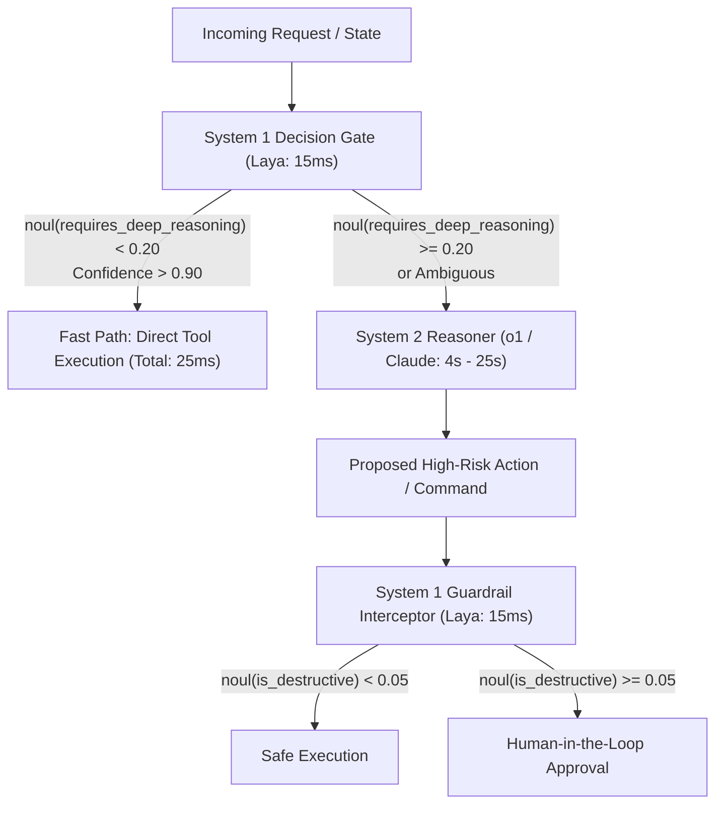

# 0006: Hybrid System 1 & System 2 Orchestration Patterns

## 1. The Cognitive Symphony: Why We Need Both Systems

In biological cognition, humans do not perform deliberate analytical reasoning (System 2) to dodge a ball or recognize a face; intuitive perception (System 1) handles it in milliseconds. Conversely, when solving advanced calculus or writing complex software architecture, System 1 alone fails and System 2 takes over.

In production AI systems, combining **System 1 (Laya/Jev)** with **System 2 (o1/o3, Claude 3.5 Sonnet, DeepSeek R1)** produces optimal throughput, cost, and safety.



---

## 2. Core Architectural Patterns

### Pattern A: Speculative Decision Gating (The 90/10 Rule)
**Problem**: Invoking a generative LLM for every user prompt costs seconds and hundreds of dollars per million queries. Yet 80–90% of requests are routine queries or simple actions.

**Implementation**:
1. Run Laya in 15ms to evaluate two questions:
   - `intent`: `choice` between available actions.
   - `needs_deliberation`: `noul` assessing whether the task requires multi-step planning or novel synthesis.
2. If `needs_deliberation < 0.15` and `confidence > 0.85`: Execute the deterministic workflow immediately.
3. If `needs_deliberation >= 0.15`: Escalate the request to the System 2 reasoning model with full prompt context.

**Result**: 85% of traffic responds in sub-50ms with zero token generation cost; System 2 compute is reserved for genuinely complex tasks.

---

### Pattern B: Real-Time Guardrail & Safety Interceptor (30 FPS)
**Problem**: Coding agents and autonomous assistants generate shell commands (`rm`, `curl`, `chmod`), SQL statements, and API calls. Generative models can hallucinate dangerous parameters or leak credentials.

**Implementation**:
Before any command reaches the OS kernel or database driver, it is intercepted by a System 1 `noul` check:

```python
guard_questions = {
    "is_destructive": {
        "type": "noul",
        "instructions": "Does this shell command permanently delete files, alter permissions, or format disks?"
    },
    "leaks_credentials": {
        "type": "noul",
        "instructions": "Does the command transmit API keys, private tokens, or sensitive files over the network?"
    }
}

# Evaluated in 15ms on local RTX 4090:
verdict = laya_router.predict(f"Agent wants to execute: {command}", guard_questions)

if verdict.answers["is_destructive"]["noul"] > 0.05 or verdict.answers["leaks_credentials"]["noul"] > 0.05:
    halt_and_prompt_human_approval(command, verdict)
else:
    execute_in_sandbox(command)
```

Because System 1 executes in 15ms, the guardrail runs at **30 frames per second**, providing zero-lag protection that is structurally incapable of hallucinating bypass tokens.

---

### Pattern C: Context Triage & Semantic Compactor
**Problem**: System 2 reasoning models have massive prompt processing overhead when fed raw 50,000-token log files or customer histories.

**Implementation**:
1. System 1 processes the raw logs across sliding windows using fast bidirectional attention.
2. System 1 emits calibrated scores (`incident_severity`, `affected_subsystems`, `error_type`).
3. The small structured output from System 1 primes the System 2 reasoning prompt.
4. System 2 focuses strictly on the root-cause diagnosis without wasting tokens parsing raw logs.

---

## 3. Comparison of End-to-End Latency Profiles

```
Generative Routing Only:
[Client Request] ──(Network)──> [LLM API (Prompt + Schema)] ──(Thinking / KV Generation: 2,400ms)──> [Parse JSON] ──> [Tool Exec]
Total: ~2,800 ms

Hybrid System 1 Gating:
[Client Request] ──> [Laya System 1 (Local 4090: 14ms)] ──> [Direct Tool Exec: 10ms]
Total: ~24 ms (116x faster)
```
